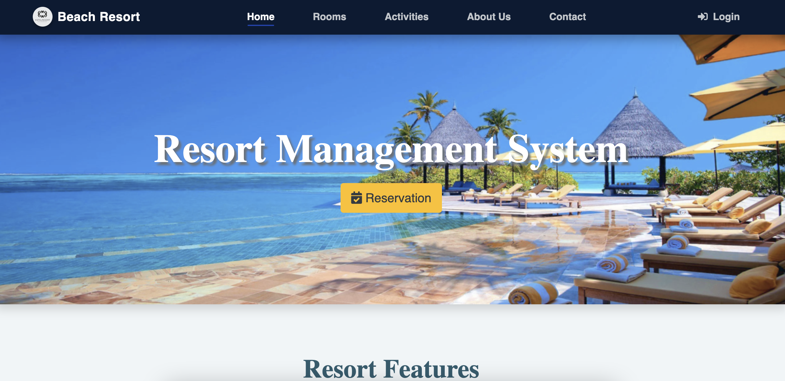

# resort-management-php

Resort Management System in PHP with a front-end website and access to a live demo.  
Manage hotel rooms, activities, reservations, enquiries, and more.

**Resort Management System (PHP & MySQL)**

🌐 Visit **y2asystem.com** for more projects and tutorials.

---

## 📌 Project Overview

The Resort Management System is a web-based application designed to manage resort operations efficiently.  
It is built using **PHP and MySQL**, providing a simple and reliable solution for handling resort-related data.

---

## 🛠️ Technology Stack

- Application Type: Web Application  
- Programming Language: PHP  
- Recommended PHP Version: 7.0 or higher  
- Database: MySQL  
- Database Name: `resort_db`

---

## Screenshots

### Home Page

### Login Page

### 🧑‍💼 Admin Dashboard

---

## 🔐 Default Login Credentials

### Admin Account
- **Username:** admin  
- **Password:** y2asystem  

### User Account
- **Username:** user  
- **Password:** password@123  

⚠️ **Security Notice:**  
It is strongly recommended to change the default login credentials after installation.

---

## 🚀 Installation

1. Download or clone the project
2. Move project folder to `htdocs` (XAMPP) or `www` (WAMP)
3. Create a database named `resort_db`
4. Import the SQL file
5. Update database configuration
6. Run the project in browser

---
